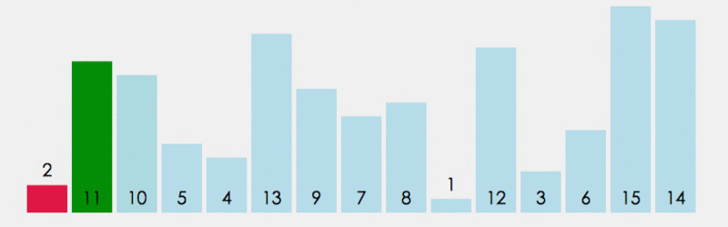
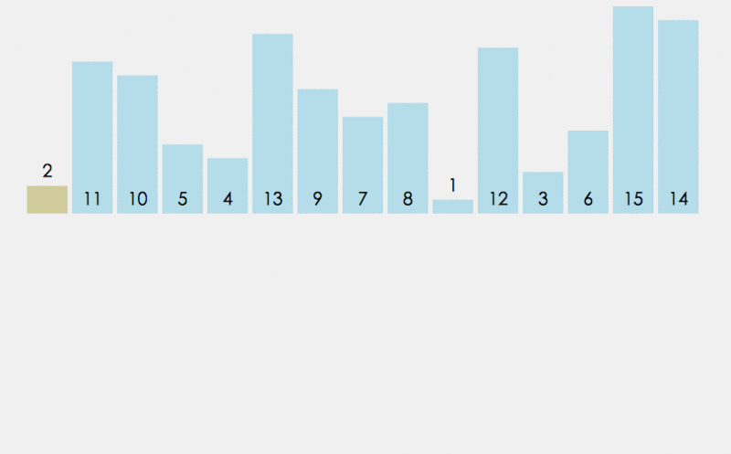
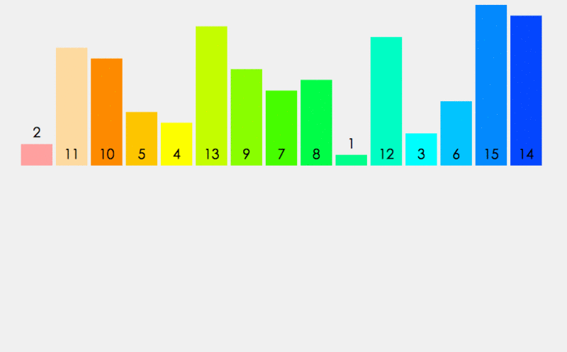
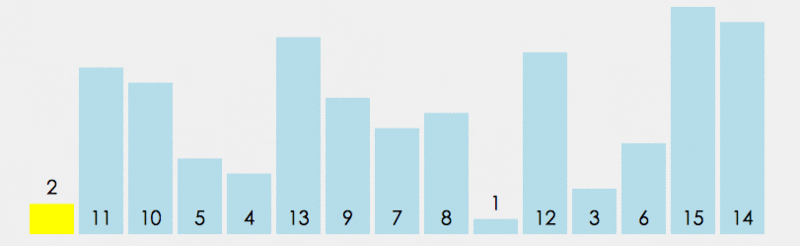
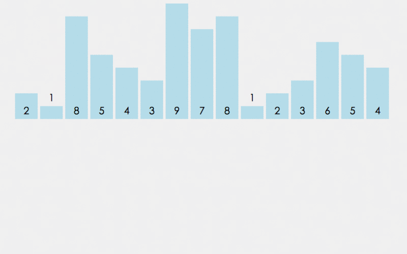
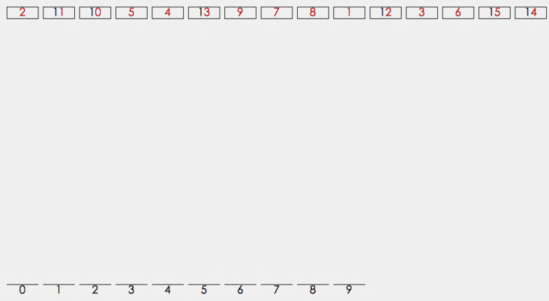

# <center>JavaScript 排序算法汇总</center>

> #### 经典排序算法对比

名词解释：

* 排序方法
    * In-place：内排序 -- 所有排序操作都在内存中完成，占用常数内存，不占用额外内存。
    * Out-place：外排序 -- 由于数据太大，因此把数据放在磁盘中，而排序通过磁盘和内存的数据传输才能进行，占用额外内存。
* 稳定性：排序后2个相等键值的顺序和排序之前它们的顺序是否相同。
    * 稳定：顺序相同
    * 不稳定：顺序不同
* n: 数据规模
* k: 桶排序中桶的个数

下图来源于网络：


> #### 冒泡排序（Bubble Sort）

##### 1.动态效果演示


##### 2.算法实现
```javascript
    // 交换元素方法
    const swap = (i, j, array) => {
        let temp;
        temp = array[i];
        array[i] = array[j];
        array[j] = temp;
    };

    const bubbleSort = (array) => {
        let length = array.length;

        for (let i = 0; i < length; i++) {
            for (let j = 0; j < length - 1 - i; j++) {
                if (array[j] > array[j+1]) {
                    swap(j, j+1, array);
                }
            }
        }

        return array;
    }

    let arr = [3,44,38,5,47,15,36,26,27,2,46,4,19,50,48];

    console.log(bubbleSort(arr));
```

##### 3.算法分析
> ##### 时间复杂度

最佳情况：完全正序 T(n) = O(n);

最坏情况：完全反序 T(n) = O(n^2);

> ##### 空间复杂度

由于冒泡排序中只有缓存的temp变量需要内存空间，因此空间复杂度为常亮O(1);

> #### 选择排序（Select Sort）

##### 1.动态效果展示



##### 2.算法实现
``` javascript
    // 交换元素方法
    const swap = (i, j, array) => {
        let temp;
        temp = array[i];
        array[i] = array[j];
        array[j] = temp;
    };

    const selectSort = (array) => {
        let length = array.length;
        let minindex;

        for (let i = 0; i < length - 1; i++) {
            minindex = i;
            for (let j = i + 1; j < length; j++) {
                if(array[minindex] > array[j]) {
                    minindex = j;
                }
            }
            minindex != i && swap(i, minindex, array);
        }

        return array;
    }

    let arr = [3,44,38,5,47,15,36,26,27,2,46,4,19,50,48];

    console.log(selectSort(arr));
```

##### 3.算法分析

> ##### 时间复杂度

最佳情况： T(n) = O(n^2);

最坏情况： T(n) = O(n^2);

> ##### 空间复杂度

同冒泡排序

> #### 插入排序（Insert Sort）

> 算法思想：把要排序的数组分为两个部分，一部分是数组的全部元素(除去待插入的元素)，另一部分是待插入的元素；先将第一部分排序完成，然后再插入这个元素。其中第一部分的排序也是通过再次拆分为两部分来进行的。
> 
> 插入顺序由于操作的不同，可以分为<code>直接插入排序</code>、<code>折半插入排序(二分插入排序)</code>、<code>链表插入排序</code>、<code>希尔排序</code>

##### 1.动态效果展示



##### 2.算法实现
> 直接插入排序： 将待排序的元素按照大小顺序，依次插入到一个已经排好序的数组中，直到所有元素都插入进去

``` javascript
    const directInsertSort = (array) => {
        let length = array.length;
        let index, current;

        for (let i = 1; i < length; i++) {
            index = i -1;
            current = array[i];
            while(index >= 0 && array[index] > current) {
                array[index+1] = array[index];
                index--;
            }
            if (index + 1 != i) {
                array[index + 1] = current;
            }
        }
        return array;
    }

    let arr = [3,44,38,5,47,15,36,26,27,2,46,4,19,50,48];

    console.log(directInsertSort(arr));
```

> 折半插入排序：是直接插入排序的升级版。鉴于插入排序第一部分为已排好序的数组，所以不必按顺序依次寻找插入点，只需比较它们的中间值与待插入元素的大小即可。

``` javascript
    const binaryInsertSort = (array) => {
        let current, low, high, mid;
        let length = array.length;
        for(let i = 0; i < length; i++) {
            low = 0;
            high = i - 1;
            current = array[i];

            while(low <= high) {
                mid = (low + high) >> 1;
                if (array[i] >= array[mid]) {
                    low = mid + 1;
                } else {
                    high = mid - 1;
                }
            }
            for (let j = i; j > low; j--) {
                array[j] = array[j - 1];
            }
            array[low] = current;
        }
        return array;
    }

    let arr = [3,44,38,5,47,15,36,26,27,2,46,4,19,50,48];

    console.log(binaryInsertSort(arr));
```

> 希尔排序：也称缩小增量排序，是直接插入排序的另一个升级版，实质就是分组插入排序。

``` javascript
    const directInsertSort = (array, gap) => {
        gap = (gap === undefined) ? 1 : gap;
        let length = array.length;
        let index, current;

        for (let i = gap; i < length; i++) {
            index = i - gap;
            current = array[i];
            while(index >= 0 && array[index] > current) {
                array[index + gap] = array[index];
                index -= gap;
            }
            if( index + gap != i) {
                array[index + gap] = current;
            }
        }

        return array;
    }

    const shellSort = (array) => {
        let length = array.length;
        let gap = length >> 1;
        let current;

        while (gap > 0) {
            directInsertSort(array, gap);
            gap = gap >> 1;
        }

        return array;
    }

    let arr = [3,44,38,5,47,15,36,26,27,2,46,4,19,50,48];

    console.log(shellSort(arr));
```

##### 3.算法分析

> ##### 时间复杂度

|插入排序|最佳情况|最坏情况|
|-------|-------|-------|
|直接插入|T(n) = O(n)|T(n) = O(n^2)|
|折半插入|T(n) = O(n)|T(n) = O(n^2)|
|希尔排序|T(n) = O(n(log2^2n))|T(n) = O(n(log2^2n))|

> #### 归并排序

##### 1.动态效果展示



##### 2.算法实现
> 算法原理：归并排序建立在归并操作之上, 它采取分而治之的思想, 将数组拆分为两个子数组, 分别排序, 最后才将两个子数组合并; 拆分的两个子数组, 再继续递归拆分为更小的子数组, 进而分别排序, 直到数组长度为1, 直接返回该数组为止.

``` javascript
const mergeSort = (array) => {
    let length = array.length;
    if (length < 2) {
        return array;
    }
    let mid = length >> 1;
    let left = array.slice(0, mid);
    let right = array.slice(mid);

    return merge(mergeSort(left), mergeSort(right));
}

const merge = (left, right) => {
    let result = [];
    while (left.length && right.length) {
        let item = left[0] <= right [0] ? left.shift() : right.shift();
        result.push(item);
    }
    return result.concat(left.length ? left : right);
}

let arr = [3,44,38,5,47,15,36,26,27,2,46,4,19,50,48];

console.log(mergeSort(arr));
```

##### 3.算法分析
> ##### 时间复杂度

最佳情况：T(n) = O(nlogn)
最差情况：T(n) = O(nlogn)

> ##### 空间复杂度

归并排序多次递归过程中拆分的子数组需要保存在内存空前，所以空间复杂度为O(n)

> #### 快速排序(Quick Sort)

##### 1.动态效果展示



##### 2.算法实现
> 算法原理：通过一趟排序将待排记录分隔成独立的两部分，其中一部分记录的关键字均比另一部分的关键字小，则可分别对这两部分记录继续进行排序，以达到整个序列有序。

``` javascript
const swap = (i, j, array) => {
    let temp;
    temp = array[i];
    array[i] = array[j];
    array[j] = temp;
};
const quickSort = (array, left, right) => {
    let index;
    left = typeof left == 'number' ? left : 0;
    right = typeof right == 'number' ? right : array.length - 1;

    if (left < right) {
        index = partition(array, left, right);
        quickSort(array, left, index - 1);
        quickSort(array, index + 1, right);
    }

    return array;
}

const partition = (array, left, right) => {
    for (var i = left + 1, j = left; i <= right; i++) {
        array[i] < array[left] && swap(i, ++j, array);
    }
    swap(left, j, array);
    return j;
}
let arr = [3,44,38,5,47,15,36,26,27,2,46,4,19,50,48];

console.log(quickSort(arr));
```

##### 3.算法分析
> ##### 时间复杂度

最佳情况：T(n) = O(nlogn)
最坏情况: T(n) = O(n^2)

> ##### 空间复杂度

O(nlogn)

> #### 堆排序 

##### 1.动态效果展示


##### 2.算法实现
> 算法原理：利用堆这种数据结构所设计的一种排序算法. 它是选择排序的一种. 堆分为大根堆和小根堆. 大根堆要求每个子节点的值都不大于其父节点的值, 即array[childIndex] <= array[parentIndex], 最大的值一定在堆顶. 小根堆与之相反, 即每个子节点的值都不小于其父节点的值, 最小的值一定在堆顶. 因此我们可使用大根堆进行升序排序, 使用小根堆进行降序排序.

``` javascript
// 交换元素方法
const swap = (i, j, array) => {
    let temp;
    temp = array[i];
    array[i] = array[j];
    array[j] = temp;
};
// 堆排序
const heapAdjust = (array, i, length) => {
    let left = 2 * i + 1;
    let right = 2 * i + 2;
    let largest = i;

    if (left < length && array[largest] < array[left]) {
        largest = left;
    }
    if (right < length && array[largest] < array[right]) {
        largest = right;
    }
    if (largest != i) {
        swap(i, largest, array);
        heapAdjust(array, largest, length);
    }
}

const heapSort = (array) => {
    // 建立大顶堆
    let length = array.length;

    for (let i = length >> 1; i >= 0; i--) {
        heapAdjust(array, i, length);
    }
    // 调换第一个与最后一个元素，重新调整为大顶堆
    for (let i = length - 1; i > 0; i--) {
        swap(0, i, array);
        heapAdjust(array, 0, --length);
    }

    return array;
}
let arr = [3,44,38,5,47,15,36,26,27,2,46,4,19,50,48];

console.log(heapSort(arr));
```
##### 3.算法分析

> 时间复杂度

最佳情况：T(n) = O(nlogn)
最坏情况：T(n) = O(nlogn)

> 空间复杂度

O(1)

> #### 计数排序(Counting Sort)

##### 1.动态效果展示



##### 2.算法实现
> 算法原理：计数排序(Counting sort)是一种稳定的排序算法。计数排序使用一个额外的数组 C，其中第 i 个元素是待排序数组 A 中值等于 i 的元素的个数。然后根据数组 C 来将 A 中的元素排到正确的位置。它只能对整数进行排序。

``` javascript
const countSort = (array, max) => {
    let tempLength = max + 1;
    let temp = new Array(tempLength);
    let index = 0;
    let length = array.length;

    for (let i = 0; i < length; i++) {
        if (!temp[array[i]]) {
            temp[array[i]] = 0;
        }
        temp[array[i]]++;
    }
    for (let i = 0; i < tempLength; i++) {
        while (temp[i] > 0) {
            array[index++] = i; // 增序
            // array[--length] = i; //降序
            temp[i]--;
        }
    }
    return array;
}
let arr = [3,44,38,5,47,15,36,26,27,2,46,4,19,50,48];
let max = 0;
for (let i = 0, len = arr.length; i < len; i++) {
    max = max > arr[i] ? max : arr[i];
}
console.log(countSort(arr, max));
```
##### 3.算法分析

> 时间复杂度

最佳情况：T(n) = O(n+k)

最坏情况：T(n) = O(n+k)

> 空间复杂度

O(k)

> #### 桶排序
##### 1.算法实现
> 算法原理：将数组分配到有限数量的桶子里. 每个桶里再各自排序(因此有可能使用别的排序算法或以递归方式继续桶排序).

> 算法基本思想：桶排序的核心就在于怎么把元素平均分配到每个桶里, 合理的分配将大大提高排序的效率.

``` javascript
// 桶排序
const bucketSort = (array, bucketSize) => {
    if (array.length === 0) {
        return array;
    }

    let i = 1;
    let min = array[0];
    let max = min;

    while (i++ < array.length) {
        if (array[i] < min) {
            min = array[i]
        } else if (array[i] > max) {
            max = array[i];
        }
    }

    // 桶的初始化
    bucketSize = bucketSize || 10;
    var bucketCount = ~~((max-min) / bucketSize) + 1,   //桶的个数
        buckets = new Array(bucketCount);               // 创建桶

    for (let i = 0; i < buckets.length; i++) {
        buckets[i] = [];            // 初始化桶
    }

    //将数据分配到各个桶中,这里直接按照数据值的分布来分配,一定范围内均匀分布的数据效率最为高效
    for (let i = 0; i < array.length; i++) {
        buckets[~~((array[i] - min) / bucketSize)].push(array[i]);
    }

    array.length = 0;

    for (let i = 0; i < buckets.length; i++) {
        quickSort(buckets[i]);      // 对每个桶进行排序，使用快速排序
        for (let j = 0; j < buckets[i].length; j++) {
            array.push(buckets[i][j]);
        }
    }

    return array;
}
let arr = [3,44,38,5,47,15,36,26,27,2,46,4,19,50,48,44,5,26,1,49,38];

console.log(bucketSort(arr));
```
##### 2.算法分析

> 时间复杂度

最佳情况：T(n) = O(n+k)

最差情况：T(n) = O(n^2)

> 空间复杂度

O(n+k)

#### 基数排序
##### 1.动态效果展示



##### 2.算法实现
> 算法原理：基于元素值的每个位上的字符来排序。

> 实现方案: 
> 
> * MSD: 由高位为基底, 先按k1排序分组, 同一组中记录, 关键码k1相等, 再对各组按k2排序分成子组, 之后, 对后面的关键码继续这样的排序分组, 直到按最次位关键码kd对各子组排序后. 再将各组连接起来, 便得到一个有序序列. MSD方式适用于位数多的序列.
> 
> * LSD: 由低位为基底, 先从kd开始排序，再对kd-1进行排序，依次重复，直到对k1排序后便得到一个有序序列. LSD方式适用于位数少的序列.

``` javascript
// 基数排序
const radixSort = (array, max) => {
    let buckets = [];
    let unit = 10;
    let base = 1;

    for (let i = 0; i < max; i++, base *= 10, unit *= 10) {
        for (let j = 0; j < array.length; j++) {
            let index = ~~((array[j] % unit) / base);   // 依次过滤出个位，十位等数字
            if (buckets[index] == null) {
                buckets[index] = [];    // 初始化桶
            }
            buckets[index].push(array[j]);
        }
        let pos = 0;
        let value;

        for (let i = 0, length = buckets.length; i < length; i++) {
            if (buckets[i] != null) {
                while((value = buckets[i].shift()) != null) {
                    array[pos++] = value;   //将不同桶里数据挨个捞出来,为下一轮高位排序做准备,由于靠近桶底的元素排名靠前,因此从桶底先捞
                }
            }
        }
    }

    return array;
}
let arr = [3,44,38,5,47,15,36,26,27,2,46,4,19,50,48,44,5,26,1,49,38];
let max = arr[0];
for (let i = 0, len = arr.length; i < len; i++) {
    max = max > arr[i] ? max : arr[i];
}
console.log(radixSort(arr, max));
```
##### 3.算法分析
> 时间复杂度

最佳情况：T(n) = O(n * k)

最坏情况：T(n) = O(n * k)

> 空间复杂度

O(n+k)

> 参考资料

[JS中可能用得到的全部的排序算法](http://louiszhai.github.io/2016/12/23/sort/)

[JavaScript 排序算法汇总](http://www.qcyoung.com/2016/12/18/JavaScript%20%E6%8E%92%E5%BA%8F%E7%AE%97%E6%B3%95%E6%B1%87%E6%80%BB/#can-kao-zi-liao-amp-tuo-zhan-yue-du)
